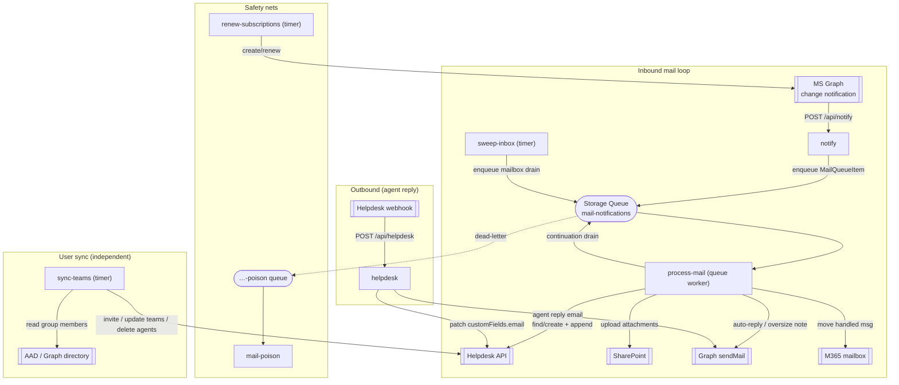
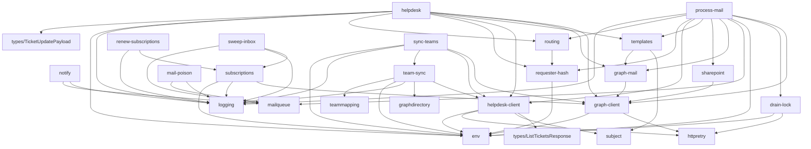

# Dependency Tree & Code Linkage Map

> Quick-reference structural map of `src/`: the runtime linkages (what triggers what), the
> module import graph (a DAG — no cycles), and per-module fan-in/fan-out. Companion to
> [`CLAUDE.md`](../CLAUDE.md) (which holds the behavioral invariants) and
> [`README.md`](../README.md) (deploy topology + env-var table).
>
> **Scope:** non-test source only (`src/**/*.ts` excluding `*.test.ts`). Tests mock at the module
> boundary, so they aren't dependency edges.
>
> **Regenerate:** `git ls-files 'src/**/*.ts' | grep -v '\.test\.ts$'` for the module list; grep
> each file's `import … from "./…"` for internal edges. Last built against branch
> `feature-user-sync-groups` (7 registered functions).

---

## 1. Registered functions (entry points)

`src/index.ts` runs `app.setup({ enableHttpStream: true })` then imports these seven modules for
**side-effect registration** (each calls `app.http` / `app.storageQueue` / `app.timer` at load).

| Function | File | Trigger | Role |
|---|---|---|---|
| `notify` | [notify.ts](../src/functions/notify.ts) | HTTP | Graph change-notification receiver; validates + enqueues a drain item. |
| `process-mail` | [process-mail.ts](../src/functions/process-mail.ts) | Queue (`mail-notifications`) | Inbound worker: drains inbox → ticket + attachments + auto-reply → move. |
| `helpdesk` | [helpdesk.ts](../src/functions/helpdesk.ts) | HTTP | Helpdesk webhook; emails requester on agent replies. |
| `renew-subscriptions` | [renew-subscriptions.ts](../src/functions/renew-subscriptions.ts) | Timer (`runOnStartup`) | Creates/renews one Graph subscription per mailbox. |
| `sweep-inbox` | [sweep-inbox.ts](../src/functions/sweep-inbox.ts) | Timer (`runOnStartup`) | Safety net: enqueues a mailbox drain even if a notification was dropped. |
| `mail-poison` | [mail-poison.ts](../src/functions/mail-poison.ts) | Queue (`…-poison`) | Logs dead-lettered drains at ERROR severity. |
| `sync-teams` | [sync-teams.ts](../src/functions/sync-teams.ts) | Timer | AAD security groups → Helpdesk agents/teams/roles reconcile (independent of the mail loop). |

Two master toggles (default-OFF, read per-invocation) gate the actioning entry points:
`TICKETING_TOGGLE` → `process-mail` + `helpdesk`; `USERMGMT_TOGGLE` → `sync-teams`
(see `env.ts`'s `ticketingEnabled` / `userMgmtEnabled`).

---

## 2. Runtime linkage map (what calls what)

**The four independent flows:**

1. **Inbound loop** — `notify` (or `sweep-inbox`) enqueues a `MailQueueItem` on the shared queue →
   `process-mail` drains the whole inbox: for each message it finds-or-creates a Helpdesk ticket,
   uploads attachments to SharePoint, sends the auto-reply via Graph `sendMail`, then moves the
   message to the processed folder (idempotency). A full page re-enqueues a continuation drain.
2. **Outbound** — Helpdesk fires its webhook → `helpdesk` emails the requester (agent replies only)
   via Graph `sendMail` and patches `customFields.email`.
3. **Safety nets** — `renew-subscriptions` keeps Graph subscriptions alive; `sweep-inbox` guarantees
   the drain runs even if delivery breaks; `mail-poison` surfaces dead-lettered drains.
4. **User sync** — `sync-teams` reconciles Helpdesk agents/teams from AAD groups; touches Helpdesk
   only, never the mail loop.

---

## 3. Module dependency graph (import DAG)

Edges point **from importer to imported**. Foundation (leaf) modules sit at the bottom.

**Layered view** (each tier depends only on tiers below it + external packages):

- **Tier 0 — foundation / leaves (no internal imports):** `env`, `http-retry`, `logging`,
  `subject`, `mail-queue`, `team-mapping`, `graph-directory`, `types/*`
- **Tier 1:** `graph-client` → (http-retry, env) · `requester-hash` → (env) · `drain-lock` → (http-retry, env)
- **Tier 2:** `graph-mail` → (graph-client) · `routing` → (requester-hash) · `sharepoint` → (graph-client) · `subscriptions` → (graph-client, logging, env) · `helpdesk-client` → (types/ListTicketsResponse, subject, http-retry, env)
- **Tier 3:** `templates` → (subject, graph-mail) · `team-sync` → (helpdesk-client, graph-directory, logging, env, team-mapping)
- **Tier 4 — entry points:** the 7 registered functions (see §1) + their imports above

---

## 4. Per-module reference

`imports` = internal modules it pulls in (fan-out). `imported by` = modules that depend on it (fan-in).
Shared **hubs** are the high fan-in rows — change them carefully.

| Module | Role | Imports (internal) | Imported by (count) |
|---|---|---|---|
| `env` | env-var helpers + feature toggles | — | **9** — graph-client, drain-lock, helpdesk-client, helpdesk, process-mail, requester-hash, subscriptions, sync-teams, team-sync |
| `logging` | step/buffered loggers, `formatAxiosError`, `safeJson` | — | **9** — helpdesk, mail-poison, notify, process-mail, renew-subscriptions, subscriptions, sweep-inbox, sync-teams, team-sync |
| `graph-client` | app-only Graph token + axios client | http-retry, env | **6** — graph-mail, helpdesk, process-mail, sharepoint, subscriptions, sync-teams |
| `helpdesk-client` | Helpdesk REST client + ticket **and** agent/team ops | types/ListTicketsResponse, subject, http-retry, env | **4** — helpdesk, process-mail, sync-teams, team-sync |
| `mail-queue` | shared Storage Queue name + binding + item shape | — | **4** — notify, process-mail, sweep-inbox, mail-poison |
| `graph-mail` | getMessage/attachments/sendMail/move + note builders | graph-client | 3 — helpdesk, process-mail, templates |
| `http-retry` | axios retry interceptor | — | 3 — drain-lock, graph-client, helpdesk-client |
| `requester-hash` | requester email encode/decode round-trip | env | 3 — helpdesk, process-mail, routing |
| `subject` | `[#shortID]` threading tag | — | 2 — helpdesk-client, templates |
| `routing` | inbox→team map, in/outbound loop guards | requester-hash | 2 — helpdesk, process-mail |
| `templates` | auto-reply / agent-reply / oversize email bodies | subject, graph-mail | 2 — helpdesk, process-mail |
| `subscriptions` | create/renew Graph subscriptions (logic) | graph-client, logging, env | 2 — renew-subscriptions, sweep-inbox |
| `drain-lock` | per-mailbox Azure blob-lease mutual exclusion | http-retry, env | 1 — process-mail |
| `sharepoint` | resolve site→drive→folder → upload | graph-client | 1 — process-mail |
| `graph-directory` | AAD group transitive-member reads | — (injected axios) | 1 — team-sync |
| `team-sync` | AAD→Helpdesk reconcile logic (`planTeamSync`, `runTeamSync`) | helpdesk-client, graph-directory, logging, env, team-mapping | 1 — sync-teams |
| `team-mapping` | hardcoded per-env group→team/role rules | — | 1 — team-sync |
| `types/ListTicketsResponse` | Helpdesk list-tickets shape | — | 1 — helpdesk-client |
| `types/TicketUpdatePayload` | webhook update payload shape | — | 1 — helpdesk |
| `types/TicketCreatedPayload` | webhook create payload shape | — | 0 in source (test fixtures only) |

**Entry-point modules** (`notify`, `process-mail`, `helpdesk`, `renew-subscriptions`, `sweep-inbox`,
`mail-poison`, `sync-teams`) have fan-in 0 — nothing imports them except `index.ts`'s side-effect
imports.

---

## 5. External dependencies

| Package | Used by | For |
|---|---|---|
| `@azure/functions` | all 7 entry modules + `logging` + `mail-queue` | registration, triggers, bindings, HTTP/Timer/Queue + `InvocationContext` types |
| `axios` | graph-client, graph-mail, graph-directory, helpdesk-client, helpdesk, http-retry, drain-lock, process-mail, sharepoint, team-sync, logging | all HTTP (Graph, Helpdesk, SharePoint, Storage REST) |
| `@azure/identity` | graph-client, drain-lock | managed-identity token acquisition (secretless auth) |
| `node:crypto` | drain-lock | lease-id generation |

Auth is **secretless** — the user-assigned managed identity federates the Graph app registration;
no client secret anywhere.

---

## 6. Notes for future edits

- The graph is a **DAG** — no import cycles. Keep it that way: leaves (`env`, `logging`, `subject`,
  `http-retry`, `mail-queue`, `team-mapping`, `graph-directory`, `types/*`) must not import upward.
- **Highest-blast-radius modules:** `env` and `logging` (fan-in 9), then `graph-client` (6). A
  breaking change there ripples across most of the codebase.
- **Logic/registration split** is intentional and mirrored twice: `subscriptions.ts` (logic) /
  `renew-subscriptions.ts` (timer), and `team-sync.ts` (logic) / `sync-teams.ts` (timer). The pure
  logic modules stay unit-testable without `@azure/functions` side effects.
- **The mail loop's four producers share one queue** via `mail-queue.ts` (`notify`, `sweep-inbox`,
  `process-mail` continuation → `mail-notifications`; `mail-poison` ← `…-poison`). A queue-name
  mismatch would silently strand mail — that's why the name lives in one place.
- Behavioral invariants that this map does **not** capture (echo suppression, requester-hash
  round-trip, idempotency/drain-lock, loop guards) live in [`CLAUDE.md`](../CLAUDE.md) §"Cross-file
  invariants".
